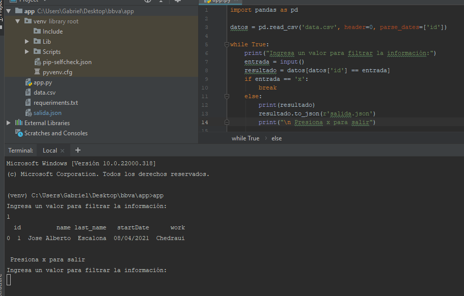

# App Filtrado de Datos BBVA

- La app lee el archivo data.csv el cual contiene la información a trabajar
- Al iniciar  el script app.py pide un dato a ingresar con el teclado, el dato es comparado con el filtro del campo 'id' y si es correcto muestra las columnas que corresponden a dicha fila y exporta el resultado en formato json al archivo salida.json:

- Para salir de la aplicación presionamos la letra 'x' de lo contrario se seguira ejecutando el bucle

